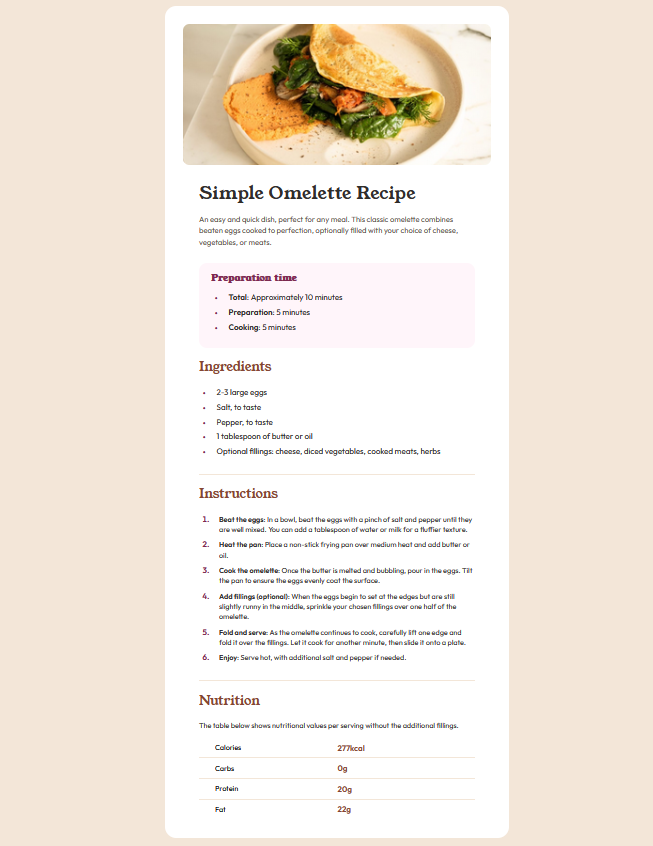

# Frontend Mentor - Recipe page solution

This is a solution to the [Recipe page challenge on Frontend Mentor](https://www.frontendmentor.io/challenges/recipe-page-KiTsR8QQKm). Frontend Mentor challenges help you improve your coding skills by building realistic projects. 

## Table of contents

- [Frontend Mentor - Recipe page solution](#frontend-mentor---recipe-page-solution)
  - [Table of contents](#table-of-contents)
  - [Overview](#overview)
    - [Screenshot](#screenshot)
    - [Links](#links)
  - [My process](#my-process)
    - [Built with](#built-with)
  - [Author](#author)

## Overview

### Screenshot

### Links

- Solution URL: [GitHub Repository](https://github.com/DevPoncet07/Frontend_Mentor_recipe_page_main)
- Live Site URL: [GitHub Pages](https://devponcet07.github.io/Frontend_Mentor_recipe_page_main/)

## My process

### Built with

- Semantic HTML5 markup
- CSS custom properties
- Flexbox
- Mobil first

## Author
PONCET Adrien
- Frontend Mentor - [@DevPoncet07](https://www.frontendmentor.io/profile/DevPoncet07)
- LinkedIn - [Adrien PONCET](www.linkedin.com/in/adrien-poncet)
